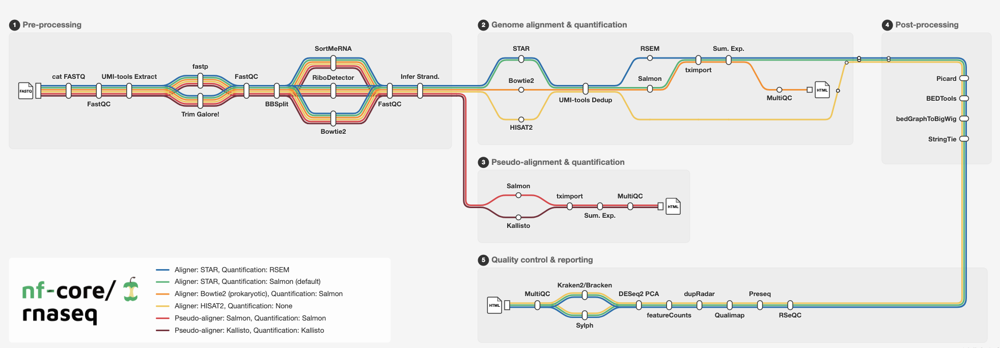

Take nf-core/rnaseq as an example: if your research question calls for a different analysis path, where should you make the change?



## 1. How Many Steps Are in nf-core/rnaseq?

The official overview lists 16 categories of tasks, but they are not 16 steps that every run executes in sequence. Broadly, the pipeline can merge FASTQ files and infer library strandedness; run FastQC; extract UMIs and trim reads; optionally remove contaminants and rRNA; align reads and quantify expression; process BAM files; generate expression and coverage outputs; and compile QC results in MultiQC. Several alignment and quantification routes are available, so the tasks that actually run **depend on your input and settings**. nf-core/rnaseq produces an expression matrix; for downstream differential expression analysis, you can use nf-core/differentialabundance.



## 2. Which Files Matter for Customization?

Before making changes, distinguish these four file types.

| File type | What it controls | What the pipeline or community provides | What you typically supply | How they relate |
|---|---|---|---|---|
| Nextflow scripts (.nf) | Analysis steps: which tools run, how data moves, and which commands are executed | main.nf is the entry point; workflows/*.nf connects steps and data; modules/.../main.nf defines individual steps and commands | Usually no .nf edits | Source code determines what runs and how steps connect |
| Parameter files | Analysis choices: input, outdir, genome, etc. | nextflow_schema.json describes parameters; nextflow.config or .nf files provide some defaults | params.yaml or params.json via -params-file; for a few values, command-line options such as --input | Your values replace the corresponding defaults |
| Configuration files | Execution settings: CPUs, memory, containers, Slurm, etc. | Pipeline nextflow.config and conf/*.config; shared cluster profiles such as uppmax.config (loaded with -profile uppmax) | custom.config when needed, passed with -c custom.config | Override only the settings you need to change |
| Samplesheet | The sample list | Pipeline documentation specifies CSV columns and format | samplesheet.csv | List your samples and FASTQ file paths |

## 3. Switch Trimming Tools with a Command-Line Parameter

Suppose you want to replace the default Trim Galore! trimmer with fastp. The pipeline already supports --trimmer fastp, so add that option to your command:

```bash
nextflow run nf-core/rnaseq -r 3.27.0 \
  --input samplesheet.csv \
  --fasta genome.fa \
  --gtf annotation.gtf \
  --trimmer fastp \
  --outdir results_fastp \
  -profile docker
```

If your parameter file also says trimmer: trimgalore, the command-line option --trimmer fastp takes precedence. To compare the tools fairly, keep the samples, reference files, and pipeline version fixed; save outputs separately; then compare retained reads, FastQC/MultiQC metrics, and downstream alignment results.

## 4. Save Analysis Choices in params.yaml

Suppose you want to keep STAR as the aligner but switch quantification from the default STAR → Salmon route to STAR → RSEM. Put the choices in params.yaml:

```yaml
input: samplesheet.csv
fasta: genome.fa
gtf: annotation.gtf
outdir: results_rsem
aligner: star_rsem
```

Pass that file when you run the pipeline:

```bash
nextflow run nf-core/rnaseq -r 3.27.0 \
  -params-file params.yaml \
  -profile docker
```

A parameter file records the data and analysis route chosen for a run.

## 5. Change Resource Settings with custom.config

Suppose STAR alignment fails because it runs out of memory. To request more resources only for STAR_ALIGN, create custom.config:

```groovy
process {
  withName: 'NFCORE_RNASEQ:RNASEQ:ALIGN_STAR:STAR_ALIGN' {
    cpus = 16
    memory = 80.GB
  }
}
```

Then run:

```bash
nextflow run nf-core/rnaseq -r 3.27.0 \
  -params-file params.yaml \
  -profile docker \
  -c custom.config
```

This file changes the CPU and memory requested for the task; the machine or cluster must have those resources available. The withName selector targets a specific process, leaving the other steps at their configured settings.

On an existing HPC cluster, check whether nf-core already provides a profile for it. At the time of writing, nf-core/configs lists 158 shared configurations, including UPPMAX. On a supported UPPMAX cluster, -profile uppmax loads its settings.

## 6. When Should You Edit .nf Files?

Maintain your own pipeline version only when you need to insert a new step into the workflow, replace a tool that the pipeline does not support, or change how data passes between steps. For example, if a new module must run after per-sample quantification and feed its output into subsequent steps, you are changing the workflow, not just selecting parameters. If the new analysis only uses the pipeline's final output, run it separately after nf-core/rnaseq finishes.

The practical order is simple: check built-in parameters first, adjust runtime configuration if needed, and edit .nf files only when the workflow itself must change.
