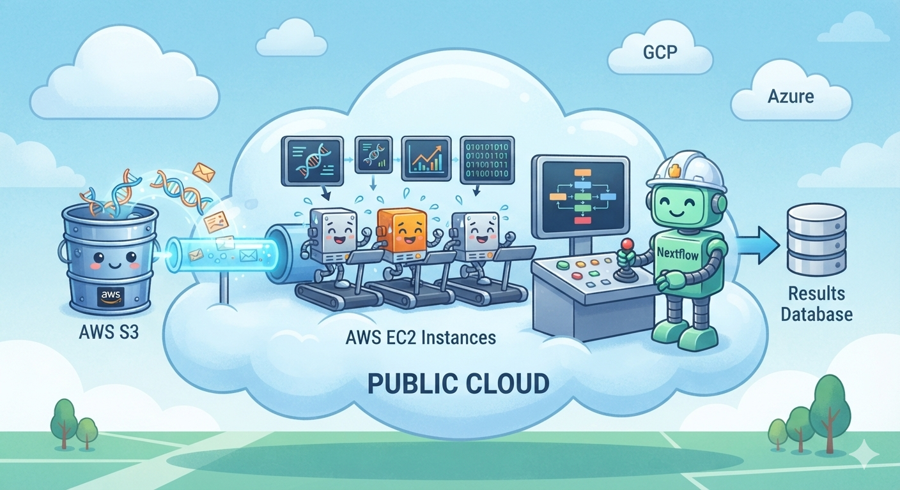

Nextflow shines when it comes to resource management, natively supporting everything from your local machine and local HPC clusters to top-tier cloud platforms. You can easily tailor your compute environment to match your specific project scale.

For **small-scale tasks**, a local setup does the trick. Just install Nextflow on your machine, configure your environment variables, and you're good to go.

For **heavy workloads**, scaling out to a compute cluster is the way to go. Nextflow seamlessly integrates with popular schedulers like Slurm, SGE, and LSF. All you need to do is specify the scheduler and its parameters in your configuration file. Tip: You can check out nf-core/configs, where the community has already shared production-ready setups for 158 institutional clusters.

If you want to tap into **cloud computing** for its limitless scalability and elastic provisioning, Nextflow has you covered. You can spin up VMs on AWS or GCP, install Nextflow, and configure your cloud credentials and resource types.

Here is a quick walkthrough of how it works on **AWS**:

1. **Step 1**: Launch an EC2 instance via the AWS Console and install Nextflow.
2. **Step 2**: Create an S3 bucket to handle your input datasets and pipeline outputs.
3. **Step 3**: Drop your AWS credentials (Access Key & Secret Key), preferred EC2 instance types, and S3 bucket details into your Nextflow config.
4. **Step 4**: Fire up your pipeline. Nextflow will automatically spin up compute resources on AWS, dispatch tasks across instances, and dump the final results straight back into your S3 bucket once finished.

Currently, Nextflow’s official community plugins only support native integration with **AWS** and **GCP**, which is a bit of a bummer for users based in China. On top of that, for biotech companies unfamiliar with cloud resource management, handling the initial setup and day-to-day DevOps for Nextflow can be a real headache.

**But look at the bright side—the payoffs for enterprises are massive**. It completely takes the burden off your IT operations team, keeping them out of the weeds of complex infrastructure management. More importantly, it dramatically shrinks the turnaround time from "raw sequencing data" to "actionable insights." By offloading the heavy lifting of infrastructure, your core scientific teams can focus entirely on what they do best: biological innovation and breakthroughs, driving true cost-efficiency in a highly competitive market.

---

## Putting It All Together: `nextflow.config`

To switch between infrastructures, you don't need to rewrite a single line of your pipeline logic. Nextflow allows you to define different environments using `profiles` in your central config file:

```nextflow
// 1. Global Parameter Defaults
params {
    input  = "./data/*.fastq.gz"
    outdir = "./results"
}

// 2. Environment Profiles (Local, Cluster, AWS)
profiles {

    // Scenario 1: Local Server (For lightweight testing and debugging)
    local_server {
        process {
            executor = 'local'
            cpus     = 2
            memory   = '8 GB'
        }
        docker.enabled = true
    }

    // Scenario 2: HPC Cluster (For large-scale tasks on existing institutional hardware)
    hpc_cluster {
        process {
            executor = 'slurm' // Can be changed to sge, lsf, etc.
            queue    = 'compute'
            cpus     = 8
            memory   = '32 GB'
            time     = '12h'
        }
        singularity.enabled    = true
        singularity.autoMounts = true
    }

    // Scenario 3: AWS Cloud (For massive, elastic, and serverless workflows)
    aws_cloud {
        process {
            executor  = 'awsbatch'
            queue     = 'nextflow-job-queue'
            container = 'biocontainers/samtools:v1.17_cv1'
        }
        
        aws {
            region = 'us-east-1'
            batch {
                cliPath = '/home/ec2-user/miniconda/bin/aws'
            }
        }
        
        // Point data inputs directly to AWS S3
        params {
            input  = 's3://my-biotech-bucket/raw-data/*.fastq.gz'
            outdir = 's3://my-biotech-bucket/results/'
        }
        
        docker.enabled = true
    }
}
```

## Switching Environments with `-profile`

Now, triggering your workflow across different environments is as simple as adding a flag:

*   **Local testing:** `nextflow run main.nf -profile local_server`
*   **HPC deployment:** `nextflow run main.nf -profile hpc_cluster`
*   **AWS cloud scaling:** `nextflow run main.nf -profile aws_cloud`
