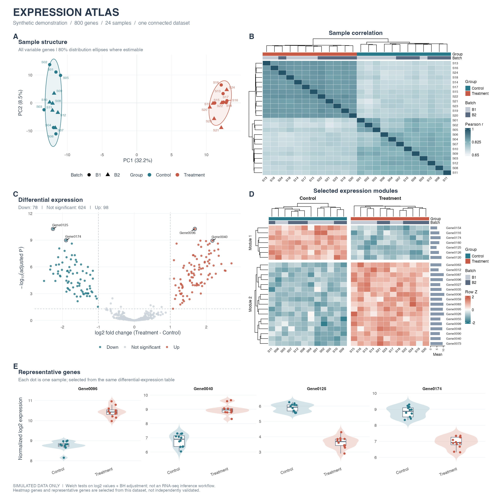

Making the same five RNA-seq figures from scratch, every single project, for the hundredth time? Yeah, me too. So I finally sat down and turned the whole mess into one R script that spits out a publication-ready panel figure and doesn't ask me a single follow-up question.



Five panels, one dataset, no copy-pasted ggplot incantations: **A** PCA with group ellipses and batch shapes, **B** a sample correlation heatmap that clusters itself, **C** a volcano plot that actually labels the genes worth knowing about, **D** a two-module expression heatmap with side bar charts for flair, and **E** violin plots for the genes everyone's going to ask about anyway. Patchwork glues them into one A–E composite so nobody has to eyeball five separate PNGs and pretend they form a coherent story.

The example data is 800 simulated genes across 24 samples — two groups, two batches. Swap in your own `expression.csv`, `samples.csv`, and `differential_expression.csv` and the whole pipeline runs on real numbers instead.

Running it is embarrassingly simple:

```r
install.packages(c('ggplot2', 'ggrepel', 'patchwork', 'ragg', 'svglite', 'circlize'),
                 repos = 'https://cloud.r-project.org')
install.packages('BiocManager')
BiocManager::install('ComplexHeatmap', ask = FALSE, update = FALSE)

source('run.R')
```

That's it. No notebook archaeology, no "wait, which chunk made the heatmap again." Every plot function also works standalone if you just want one panel for a talk instead of the whole gallery.

Code's right here, help yourself: [r-rnaseq-plot-gallery](https://github.com/yujuan-zhang/r-rnaseq-plot-gallery)
