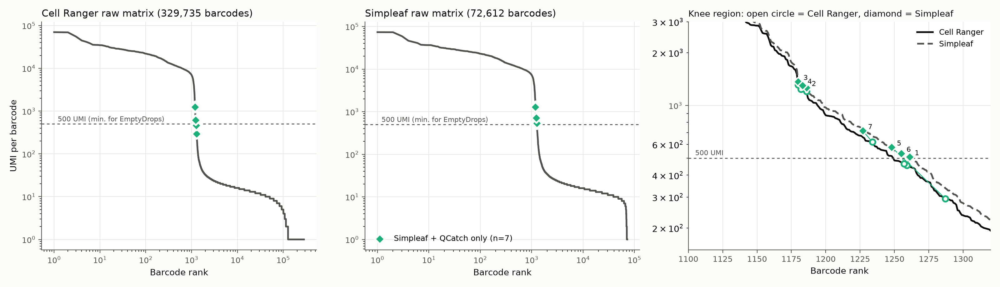
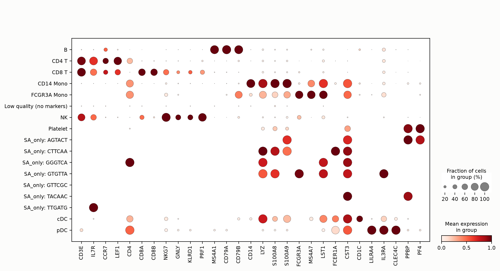
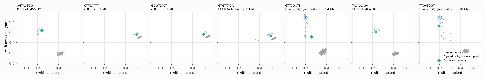
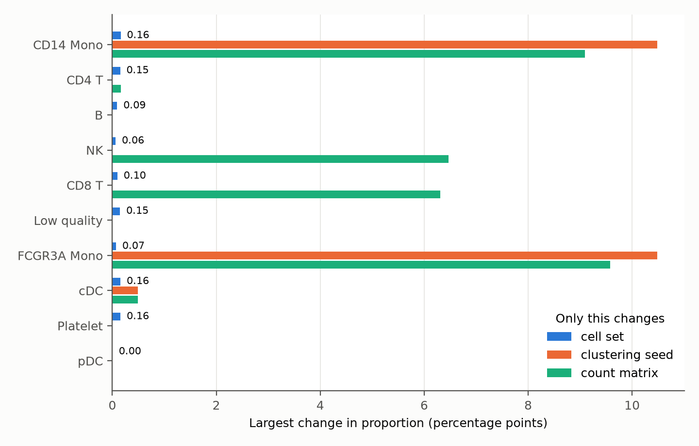
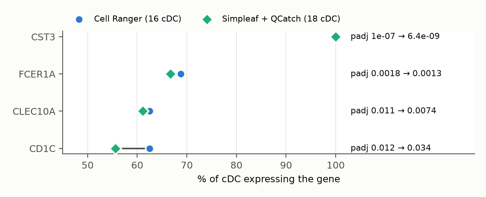

::: {.lang-switch}
[English](index.md)
:::

## 为什么做这个

Nextflow 管理并记录分析过程，nf-core/scrnaseq 提供单细胞RNA的多条标准化处理路线。我想知道：**同一批测序数据，为什么不同路线保留的细胞不完全相同？** 多出的 barcode 是真实细胞、背景 RNA，还是低质量液滴？它们会不会改变生物学结论？

## 方法

数据为 10x 公开的 [PBMC 1k v3](https://www.10xgenomics.com/datasets/1-k-pbm-cs-from-a-healthy-donor-v-3-chemistry-3-standard-3-0-0)，流程为 [nf-core/scrnaseq 4.2.0](https://nf-co.re/scrnaseq/4.2.0)。两边使用同一批 FASTQ、GRCh38-2024-A 参考：Cell Ranger 用预建索引，Simpleaf 用包内 FASTA/GTF 建索引。

版本为 Cell Ranger 10.0.0、Simpleaf 0.19.5、QCatch 0.2.12。
**这里比较的是 Cell Ranger 与 Simpleaf＋QCatch：Simpleaf 负责计数，QCatch 负责后续细胞识别。**

上游在 AWS r6i.4xlarge（16 vCPU、128 GiB）运行，采用 CloudFormation 自动安装、分析、上传结果后自动终止实例。成功的一次全程 84 分钟；账单约 $2.05，含 3 次失败尝试，成功的那次约 $1.41。本样本的下游比较在 8 GB Mac 个人电脑上完成。

## 1. 到底差了哪些 barcode？

先比较三个 barcode 集合：共同保留、仅 Cell Ranger、仅 Simpleaf＋QCatch。

```python
# 从两份筛选结果读取并统一 barcode 后缀
shared = cr_cells & sa_cells
cr_only = cr_cells - sa_cells
sa_only = sa_cells - cr_cells

print(len(shared), len(cr_only), len(sa_only))
# 1221 0 7
print(len(shared) / len(cr_cells | sa_cells))
# 0.9943：交集 / 并集
```

这 7 个 barcode 都集中在细胞与背景的过渡区域。



*横轴为 UMI 排名，纵轴为 UMI 数。右图空心圆为 Cell Ranger，菱形为 Simpleaf；连线对应同一 barcode。500 UMI 是本次实现的检验门槛，不是所有 EmptyDrops 分析的固定值。*

按交集／并集计算，细胞集合一致率为 **99.4%**。共同细胞中，每个细胞总 UMI 的 Spearman 相关系数为 0.9997，Simpleaf 平均计数约高 5%。**整体高度一致，但小差异能改变边界 barcode 的去留。**

还要注意：图中的两份“原始矩阵”分别包含 329,735 和 72,612 个 barcode。它们的上游保留范围不同，不能当成完全相同的液滴全集。

## 2. 多出的 7 个像真实细胞吗？

| 编号 | 初步判断 | UMI：CR → SA | 检出基因数 | 线粒体比例 |
| --- | --- | --- | --- | --- |
| 1 | 血小板样：PPBP、PF4 | 455 → 508 | 178 | 6% |
| 6 | 血小板样：PPBP | 464 → 532 | 172 | 18% |
| 2 | cDC 样：FCER1A、CST3 | 1,200 → 1,262 | 753 | 5% |
| 3 | 单核／DC 样：LYZ、CST3 | 1,309 → 1,366 | 815 | 7% |
| 4 | FCGR3A 单核样 | 1,239 → 1,298 | 802 | 3% |
| 5 | 低质量，无明确 marker | 294 → 577 | 121 | 52% |
| 7 | 低质量，无明确 marker | 618 → 716 | 67 | 90% |



*点大小为检出比例，颜色为相对表达。SA_only 每行仅一个 barcode，标签为初步判断。*

1、6 号有血小板 marker。**低 UMI 不等于空液滴：血小板本身 RNA 就少。** 5、7 号线粒体比例很高，应标为低质量候选，而非直接认定“濒死”。

低深度会影响表达相关性，因此我设置了同深度对照：下采样的同类细胞，以及环境 RNA 模拟的空液滴。



*横轴为与环境 RNA 的相关性，纵轴为与候选细胞类型的相关性。蓝：下采样细胞；灰：模拟空液滴；绿：差异 barcode。*

1、6 号更接近血小板对照；7 号远离模拟空液滴，5 号介于两者之间，两者都不代表质量合格。2、3、4 号的两类对照区分较弱：环境 RNA 与单核／DC 表达谱相似，相关性不足以裁定它们是不是细胞。

## 3. 是细胞识别算法不同，还是输入计数不同？

我用**同一套 QCatch 代码和参数**，以 OrdMag＋EmptyDrops 框架重新识别两份矩阵。

```python
# QCatch 内部接口节选；m 为 CountMatrix，cc 为细胞识别模块。
# 导入、版本及矩阵转换见 analysis/，不是独立运行脚本。
initial = cc.initial_filtering_OrdMag(m, "10X_3p_v3", None)
res = cc.find_nonambient_barcodes(m, initial, "10X_3p_v3", None)
called = {b.decode() for b in initial} | set(res.eval_bcs[res.is_nonambient])
```

Cell Ranger 矩阵仍得到 1,221 个，Simpleaf 矩阵仍得到 1,228 个，与原结果逐个一致。改变随机种子和模拟次数后，本次分歧也未消失。

**同一识别实现仍有分歧，接下来应查输入矩阵。** 但输入差异包括计数和背景 barcode 范围，不能只归因于某个单一因素。

### 3 个跨过了 500 UMI 门槛

1、5、6 号在 Cell Ranger 矩阵中低于 500 UMI，未进入这一步的非背景检验；在 Simpleaf 矩阵中则超过门槛。额外计数中，DHFR 占了显著一部分。

| 编号 | 总 UMI 增量 | DHFR 增量 | SA 扣除 DHFR 与一个 chr8 lncRNA 后的 UMI |
| --- | --- | --- | --- |
| 1 | 53 | 19 | 485 |
| 6 | 68 | 29 | 495 |
| 5 | 283 | 236 | 341 |

移除这两个基因并重新识别，三个 barcode 都不再被保留。**少数基因的计数，足以改变它们能否进入检验。**

DHFR 的差异也出现在共同细胞中：Simpleaf 计数为 45,624 UMI（其中 unspliced 45,532），Cell Ranger 为 739。我进一步检查了 Cell Ranger BAM 中的 DHFR 区域：

```python
from collections import Counter
import pysam

# BAM_URL、BAI_URL 为已有 BAM 及索引的临时访问链接。
with pysam.AlignmentFile(BAM_URL, index_filename=BAI_URL) as bam:
    mapq = Counter(r.mapping_quality
                   for r in bam.fetch("chr5", 80626226, 80655002))
print(mapq)
# Counter({1: 4718, 3: 2747, 255: 1519, 0: 4})
```

约 83% 的比对记录 MAPQ 低于 255；这些记录高度集中在一个约 200 bp 的内含子窗口，NH 标签为 2–4，即同一条 read 能比对到基因组 2–4 个位置。

**重复序列是 DHFR 异常计数的线索。** 两条路线的参考目标和比对／分配规则不同，可能导致这些 reads 的归属不同。未逐条核对 Simpleaf 的 read 分配，因此机制仍是推断，chr8 lncRNA 也不能凭类比认定原因。

注意：Cell Ranger 会根据基因归属调整 MAPQ，不能简化为“只计唯一基因组比对”。MAPQ＝255 不必然代表原始 STAR 比对只有一个位置。[10x BAM 标签说明](https://www.10xgenomics.com/support/software/cell-ranger/latest/analysis/cr-outputs-bam)

### 另外 4 个在统计阈值附近

2、3、4 号都进入检验，但校正后 p 值从 Cell Ranger 的约 0.004 变为 Simpleaf 的约 0.0001，跨过本次 0.001 的阈值。7 号也在阈值附近。这几个未找到明确的单一来源，目前解释到统计阈值层面，而非 read 层面。

## 最后：这 7 个值得在意吗？

**对细胞类型比例：几乎没有影响。** 我固定计数、聚类和注释，只改变细胞集。多出的 7 个分属 4 类：血小板 2 个、cDC 2 个、FCGR3A 单核 1 个、低质量 2 个。其余细胞类型的细胞数完全没变，只是分母从 1,221 变成 1,228，比例被稀释，最多 0.16 个百分点。按常见 QC（≥ 200 个基因、线粒体 ≤ 20%）过滤后，差异只剩 3 个细胞：2 个 cDC、1 个 FCGR3A 单核。

这个变化有多小？我在同一流程里只改聚类随机种子，或只换计数矩阵，作为对照：



*蓝：只换细胞集；橙：只换聚类随机种子（0–4）；绿：只换计数矩阵（Cell Ranger 或 Simpleaf）。*

细胞集带来的变化最多 0.16 个百分点；随机种子或计数矩阵却能让单核、NK／CD8 T 的比例变化 6–10 个百分点。后两项来自我这套简单的聚类／注释方法，不能推广为工具差异。**比起这 7 个 barcode，注释对分析设置的敏感性更值得检查。**

**对小细胞群的 marker：有影响，但有限。** cDC 只有 16 个细胞，多 2 个就是 +12.5%。



CST3、FCER1A、CLEC10A 的结论不变。CD1C 变弱：表达比例从 63% 降到 56%，校正后 p 值从 0.012 升到 0.034，因为新增的 2 个细胞不表达 CD1C。另外，QC 后两边是同一批 15 个血小板，PPBP 的 marker 排名却从第 13 变为第 1，因为前列基因分数接近。**看 marker，要看表达比例、效应大小和统计证据，不能只看排名。**

## 结论

同一批 FASTQ，Cell Ranger 保留 **1,221 个细胞**，Simpleaf＋QCatch 保留 **1,228 个**，前者全部包含在后者中。我追查了多出的 **7 个 barcode**：3 个因额外计数跨过 UMI 门槛，DHFR 内含子重复序列是其中的重要线索；另外 4 个处于统计阈值附近。只改变细胞集时，细胞类型比例最多变化 **0.16 个百分点**。这 7 个对整体细胞类型比例影响很小，但少数基因与固定阈值足以改变去留。两次比较仅使用了一份 PBMC 样本；两种流程在其他数据中是否同样接近，还需要进一步验证。

## 复现

- AWS 模板：[scrnaseq-comparison.yaml](scrnaseq-comparison.yaml)。
