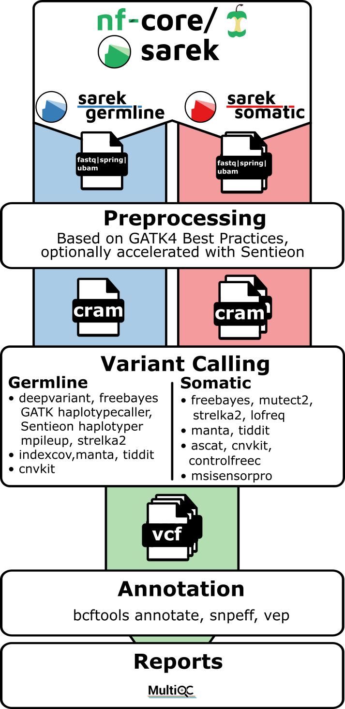

# nf-core/sarek: From DNA Reads to Variant Discovery

## A Swedish Name, a Practical Purpose

Sarek shares its name with a national park in northern Sweden. Early releases used names such as Ruotes and Skårki, giving the project a distinctive geographic identity. The connection appears in the [developer's 2020 presentation](https://maxulysse.github.io/nf-core2020/).

The workflow originated at SciLifeLab's National Genomics Infrastructure (NGI) and National Bioinformatics Infrastructure Sweden (NBIS), with support from the Swedish Childhood Tumor Biobank. Developers at Germany's QBiC later joined the project and contributed to its development and Nextflow DSL2 implementation.[1]

**nf-core/sarek is a reproducible workflow for DNA variant discovery.** It supports whole-genome, exome and targeted sequencing, with separate germline and somatic analysis routes. Depending on the selected tools, it detects small variants, structural variants, copy-number changes and microsatellite instability.

DNA sequencing produces reads that must be aligned to a reference genome before differences can be identified. Running this analysis manually requires coordinating software versions, file formats and computing environments. Sarek organizes these tasks into a consistent workflow:

**Preprocessing → Variant calling → Annotation → Quality reporting.**[1]

## 1. How Popular Is Sarek?

As checked on October 8, 2026, Sarek had approximately **612 GitHub stars**, compared with roughly **1,400** for nf-core/rnaseq. These figures indicate community interest, rather than execution counts or analytical accuracy.[3]

## 2. Why Variant Analysis Matters

If the genome is an instruction manual, RNA expression analysis measures which sections are being read and how frequently. DNA variant analysis identifies changes to the text itself.

Its applications include:

- **Genetic disease research:** identifying variants that may disrupt gene function.
- **Cancer research:** detecting acquired mutations, amplifications and deletions.
- **Population genetics:** studying genetic differences between individuals and their associations with traits.

A difference from the reference genome is not necessarily harmful. Many variants represent ordinary genetic variation; annotation, filtering and additional evidence are needed to assess their significance.

## 3. Supported Data

| Sequencing approach | Scope |
|---|---|
| Whole-genome sequencing (WGS) | Genome-wide coverage |
| Whole-exome sequencing (WES) | Primarily exonic regions |
| Targeted sequencing (panels) | Selected genes or genomic regions |

Sarek can start from raw reads, or from existing alignment or variant files at the appropriate entry point. It supports normal, tumor and additional relapse samples from the same patient. Initially developed for human and mouse data, it can also analyze other species with a suitable reference genome, compatible tools and annotation resources.[1]

## 4. Beyond Single-Base Changes

| Analysis | Change detected | Representative tools |
|---|---|---|
| Single-nucleotide variants (SNVs) | A single-base substitution, such as A → G | HaplotypeCaller, DeepVariant, Mutect2 |
| Small insertions and deletions (indels) | Short sequence insertions or deletions | HaplotypeCaller, Mutect2, Strelka2 |
| Structural variants (SVs) | Larger deletions, inversions or rearrangements | Manta, TIDDIT |
| Copy-number variants (CNVs) | Gains or losses of genomic copies | ASCAT, CNVkit, Control-FREEC |
| Microsatellite instability (MSI) | Instability in short tandem-repeat lengths | MSIsensor-pro |

Tool selection depends on the sample design, sequencing approach and biological question. These are optional analysis routes, rather than a list of tools that must all run together.[1]

## 5. Why Separate Germline and Somatic Routes?

**Germline analysis identifies constitutional variants**, usually present in nearly all cells. These may be inherited or arise de novo.

**Somatic analysis identifies variants acquired in a subset of cells.** In cancer studies, comparing a tumor with a matched normal sample helps distinguish acquired changes from the individual's germline background.

The statistical assumptions differ. At a diploid autosomal locus without copy-number changes, a heterozygous germline variant typically has a variant allele fraction (VAF) near 50%. Tumor samples contain mixtures of normal cells, cancer cells and tumor subclones, so genuine somatic variants may have much lower VAFs.

For example, if 20% of cells carry a heterozygous mutation and all cells are diploid at that locus, the expected VAF is:

$$
\mathrm{VAF} \approx 20\% \times \frac{1}{2} = 10\%
$$

The caller must distinguish this signal from sequencing or alignment errors. Germline and somatic detection therefore require different models and filters: HaplotypeCaller primarily targets germline variants, while Mutect2 targets somatic variants.[1]

## 6. Workflow

Figure 1 shows the germline and somatic routes, their shared processing stages and representative tools.

*Figure 1. Sarek workflow overview (Sarek 3.5.1). Source: nf-core/sarek.[1]*

### Step 1: Preprocessing

Check read quality, optionally trim adapters, align reads to the reference genome, mark duplicates and perform base quality score recalibration where appropriate.[1]

These steps reduce misleading evidence: PCR copies are not independent observations, and incorrectly aligned reads can create apparent variants.

### Step 2: Variant Calling

Select callers for the study design and variant classes of interest. Examples include HaplotypeCaller or DeepVariant for germline small variants, Mutect2 for somatic small variants, and Manta for structural variants.[1]

### Step 3: Annotation

VEP and SnpEff add biological context, including affected genes and transcripts, amino-acid changes and predicted splice effects. Annotation translates genomic coordinates into potential functional consequences.[1]

### Step 4: Reporting

Outputs include processed alignments, VCF files and tool-specific results. CNV and MSI analyses also generate their own tables or plots. MultiQC summarizes metrics such as coverage, alignment statistics and duplication rates.[1]

::: {.callout-tip}
**[Execution report](execution_report_2026-08-31_21-28-04.html){target="_blank"}**: records how the entire Nextflow pipeline ran, showing whether each step succeeded, along with its runtime and resource usage.
:::

## 7. Reproducibility Across Computing Environments

Sarek uses Nextflow to coordinate tasks and containers to manage software environments. This supports consistent execution on local machines, clusters and cloud infrastructure, reducing the manual work required to connect individual tools.[1]

## References

1. [Sarek 3.5.1: Official documentation](https://nf-co.re/sarek/3.5.1/)
2. [nf-core pipeline directory](https://nf-co.re/pipelines)
3. GitHub repositories: [nf-core/sarek](https://github.com/nf-core/sarek) and [nf-core/rnaseq](https://github.com/nf-core/rnaseq). Star counts checked on October 8, 2026.
