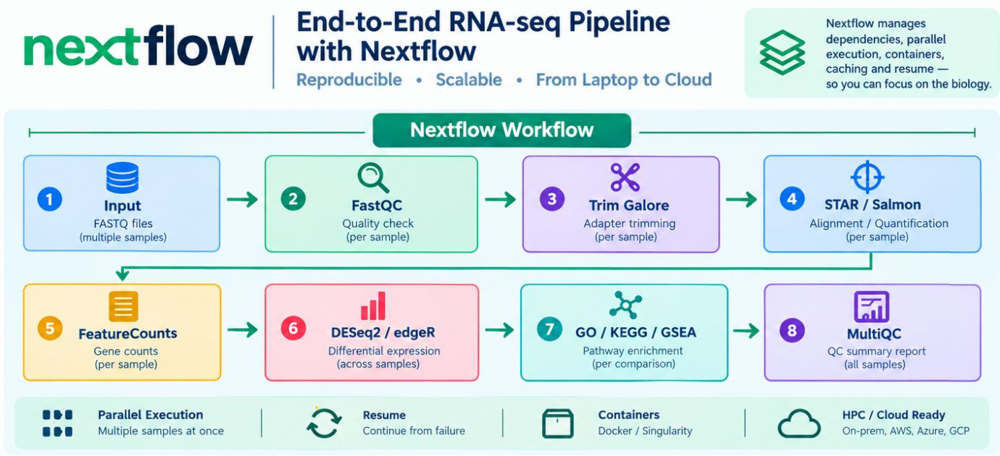

In modern computational biology, reproducibility is no longer a bonus. It is the standard.

Running an RNA-seq pipeline once is no longer the hard part. The real test is running it again—across hundreds of samples, different collaborators, HPC clusters, and the cloud—and getting results you can trust every time.

That is why Nextflow is becoming an essential skill alongside R and Python. A pipeline that works only on your laptop is a fragile experiment. A workflow that others can run and reproduce is research they can build on.

Imagine being able to answer "yes" to all three questions:

- Can I process 500 RNA-seq samples with the same workflow?
- Can collaborators run it on an HPC cluster, AWS, or Azure?
- If a sample fails halfway through, can I resume the analysis without starting over?

The infographic shows a typical RNA-seq pipeline, but the same workflow approach applies to:

- Single-cell RNA-seq (Cell Ranger → Scanpy or Seurat)
- ChIP-seq (Bowtie2 → MACS3 peak calling)
- WGS/WES variant calling (BWA → GATK → VEP)
- Shotgun metagenomics (fastp → MEGAHIT assembly → MetaBAT2 binning)
- DNA methylation sequencing (Bismark alignment → methylation calling)

**Want to explore real Nextflow workflows? Start here:**

1. **[nf-core Pipelines](https://nf-co.re/pipelines)** — A community collection of tested pipelines covering RNA-seq, ChIP-seq, methylation analysis, metagenomics, and more.
2. **[Awesome Nextflow](https://github.com/nextflow-io/awesome-nextflow)** — A curated collection of pipelines, examples, modules, and learning resources.
