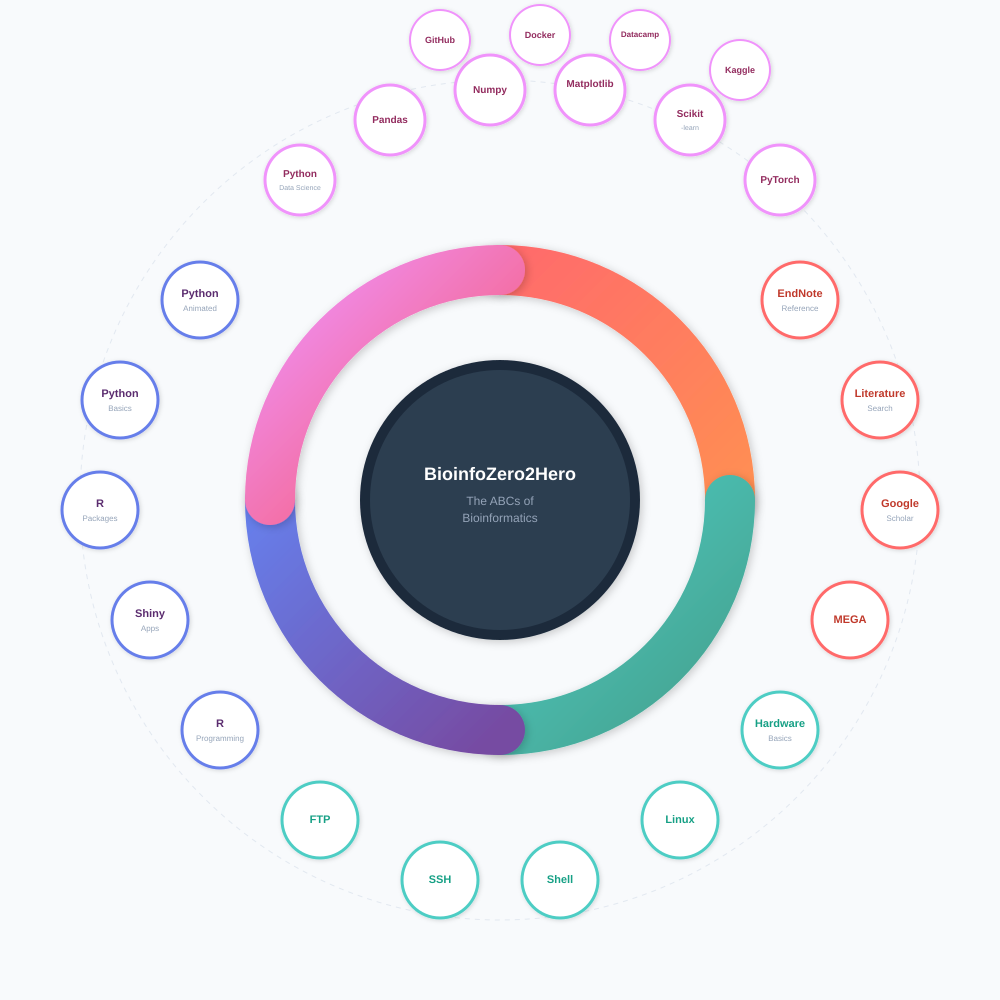

# Bioinfo from Zero to Hero: The ABCs of Bioinformatics for starters and New Lab Members

***Bioinfo-Zero2Hero*** is an onboarding knowledgebase designed to help starter of bioinformatics build essential skills, understand common workflows, and quickly integrate into ongoing research projects.

This is the ***Cover Page*** of this course.

## 👩‍🏫👨‍🏫 Authors and maintainers 

Yujuan Zhang1,†

1) College of Life Sciences, Chongqing Normal University, Chongqing 401331, China

- †	Correspondence: yujuan.zhang418@gmail.com

---

## Course Modules

> **Note**: This course provides a comprehensive learning path for bioinformatics beginners, organized into **4 modules** with **24 courses**.

### 📦 Windows Software Series

| No. | Course | Video | Resource | Date | Instructor |
| :----: | :---- | :----: | :----: | :----: | :----: |
| 01 | EndNote Quick Start Guide |  |  | Jan. 20th, 2026 | Yujuan Zhang |
| 02 | Comprehensive Literature Search and Tracking |  |  | Jan. 28th, 2026 | Yujuan Zhang |
| 03 | Google Scholar: Step-by-Step Guide |  |  | Jan. 20th, 2026 | Yujuan Zhang |
| 04 | MEGA: Phylogenetic Analysis |  |  | Jan. 20th, 2026 | Yujuan Zhang |

### 🖥️ Computer & Server Series

| No. | Course | Video | Resource | Date | Instructor |
| :----: | :---- | :----: | :----: | :----: | :----: |
| 1 | Introduction to Computer Hardware |  |  | Jan. 20th, 2026 | Yujuan Zhang |
| 2 | Linux for Beginners |  |  | Jan. 20th, 2026 | Yujuan Zhang |
| 3 | Shell Scripting for Beginners |  |  | Jan. 20th, 2026 | Yujuan Zhang |
| 4 | SSH Command Tutorial |  |  | Jan. 20th, 2026 | Yujuan Zhang |
| 5 | FTP Tools Tutorial |  |  | Jan. 20th, 2026 | Yujuan Zhang |

### 💻 Programming Languages Series

| No. | Course | Video | Resource | Date | Instructor |
| :----: | :---- | :----: | :----: | :----: | :----: |
| 1 | R Programming for Beginners |  |  | Jan. 20th, 2026 | Yujuan Zhang |
| 2 | R Shiny Tutorial |  |  | Jan. 20th, 2026 | Yujuan Zhang |
| 3 | Building R Packages |  |  | Jan. 20th, 2026 | Yujuan Zhang |
| 4 | Python Programming for Beginners |  |  | Jan. 20th, 2026 | Yujuan Zhang |
| 5 | Python Programming (Animated Version) |  |  | Jan. 20th, 2026 | Yujuan Zhang |

### 🤖 Data Science Series
| No. | Course | Video | Resource | Date | Instructor |
| :----: | :---- | :----: | :----: | :----: | :----: |
| 1 | Python for Data Science |  |  | Jan. 20th, 2026 | Yujuan Zhang |
| 2 | Pandas: Handling Tables in Python |  |  | Jan. 20th, 2026 | Yujuan Zhang |
| 3 | Numpy: Powerful Numerical Computations |  |  | Jan. 20th, 2026 | Yujuan Zhang |
| 4 | Matplotlib: Data Visualization in Python |  |  | Jan. 20th, 2026 | Yujuan Zhang |

### 🤖 Machine Learning Series
| 5 | Scikit-learn: Machine Learning Library for Python |  |  | Jan. 20th, 2026 | Yujuan Zhang |
| 6 | PyTorch: Getting Started with Deep Learning |  |  | Jan. 20th, 2026 | Yujuan Zhang |
| 7 | GitHub: Collaborative Development Tutorial |  |  | Jan. 20th, 2026 | Yujuan Zhang |
| 8 | Docker Quick Start Guide |  |  | Jan. 28th, 2026 | Yujuan Zhang |
| 9 | Datacamp: Learn Data and AI |  |  | Jan. 20th, 2026 | Yujuan Zhang |
| 10 | Kaggle: Your Machine Learning and Data Science Community |  |  | Jan. 20th, 2026 | Yujuan Zhang |

---

  <i>Happy Learning! If you find this helpful, please give it a ⭐</i>

