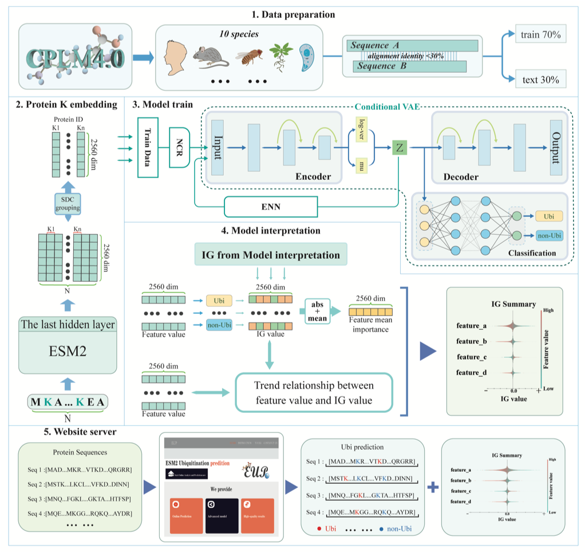
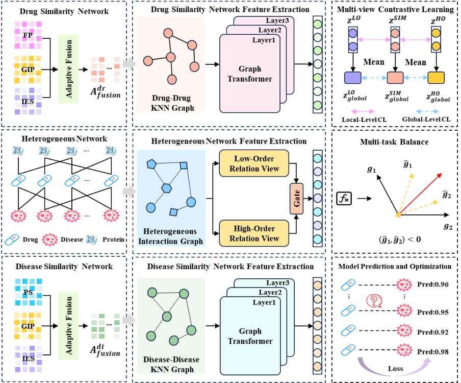
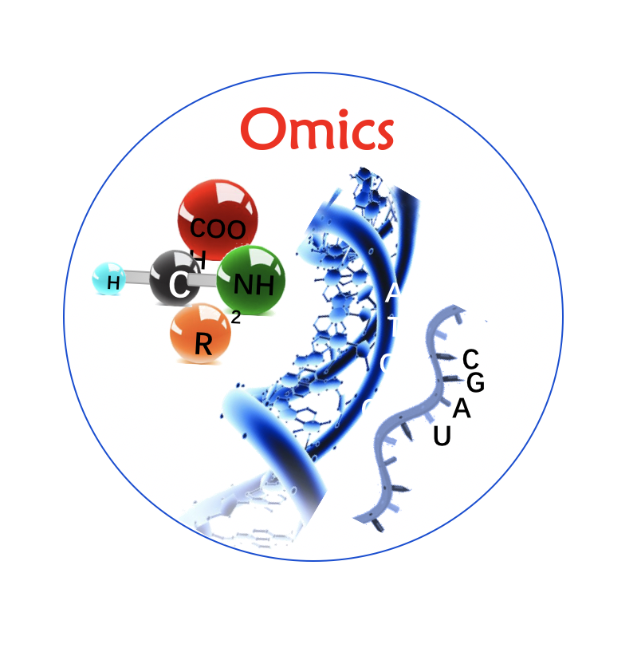
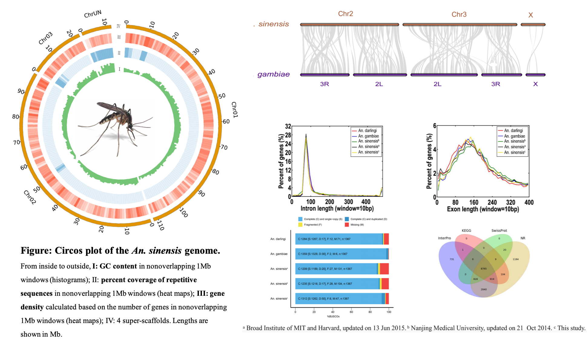
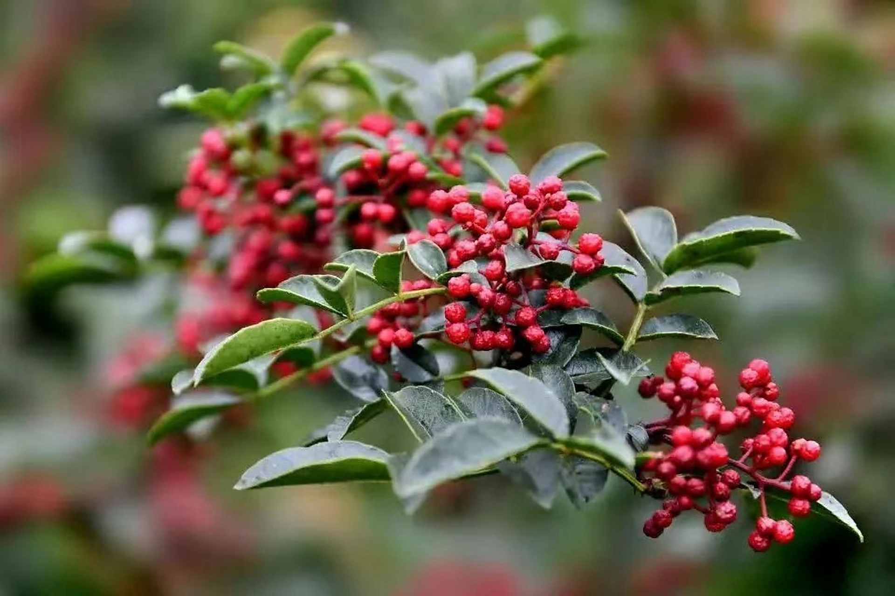
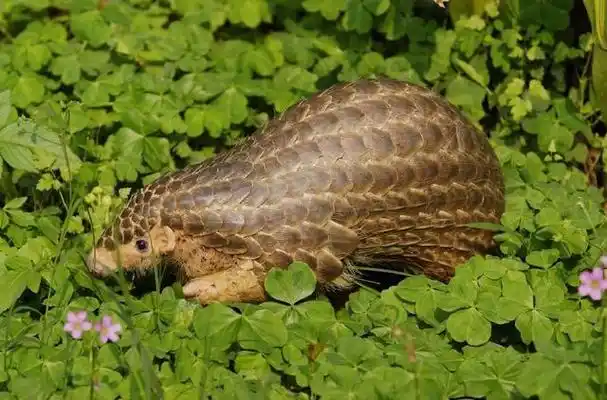

## BioAI

**Interpretable Protein LLMs for Ubiquitination Prediction**
Built an ESM2-centered pipeline linking representation extraction, dimensionality reduction, and prediction. Developed interpretable models using embedding-based interpretation and attention-based analysis; contributed to code, data processing, and manuscripts.

**Graph AI for Predicting Drug-Disease Links (Drug Repositioning)**
Built a multi-view heterogeneous GNN to integrate noisy similarity networks and meta-paths for drug-disease association prediction. Improved robustness via contrastive learning; led implementation, benchmarking, and manuscript preparation.

**Multi-Omics for Cancer Biomarker Discovery**
Performed integrative analysis of WGS, RNA-seq, antibody-based protein profiling, and clinical metadata to support biomarker discovery and cross-cohort assessment. Contributed across data preprocessing, QC, statistical analysis, and result interpretation.

**Integrative Multi-Omics in the Non-model Malaria Vector (*Anopheles sinensis*)**
Generated a de novo genome assembly and analyzed gene families associated with hematophagy and disease transmission. Integrated transcriptome, microRNA, metagenome, and resequencing data from pyrethroid-susceptible/resistant populations to infer resistance mechanisms (variants, selection, regulation, temporal expression); contributed end-to-end.

## BioSynthesis + BioAI

**Screening, Optimization, and Rational Design of Key Enzymes in Microbial Biosynthesis of Capsaicinoids**
Applied AI-driven approaches for enzyme screening and optimization in capsaicinoid biosynthesis pathways.

**Identification, Optimization, and Rational Design of Functional Components from Pangolin Scales and Porcine Hooves**
Utilized computational methods to identify and optimize bioactive components for pharmaceutical applications.

## Kaggle Competitions

My Kaggle Profile: <https://www.kaggle.com/yujuanzhangai>

- **Diabetes Prediction Challenge** - Playground Series - Season 5, Episode 12 (Playground · 4206 Teams)
- **CAFA 6 Protein Function Prediction** - Predict the biological function of a protein (Research · 2190 Teams)
- **Stanford RNA 3D Folding** - Solve RNA structure prediction, one of biology's remaining grand challenges (Featured · Code Competition · 1516 Teams)
- **Binary Prediction of Poisonous Mushrooms** - Playground Series - Season 4, Episode 8 (Playground · 2422 Teams)
- **ISIC 2024 - Skin Cancer Detection with 3D-TBP** - Identify cancers among skin lesions cropped from 3D total body photographs (Research · Code Competition · 2739 Teams)
- **NeurIPS 2024 - Predict New Medicines with BELKA** - Predict small molecule-protein interactions for drug discovery (Research · Code Competition)
