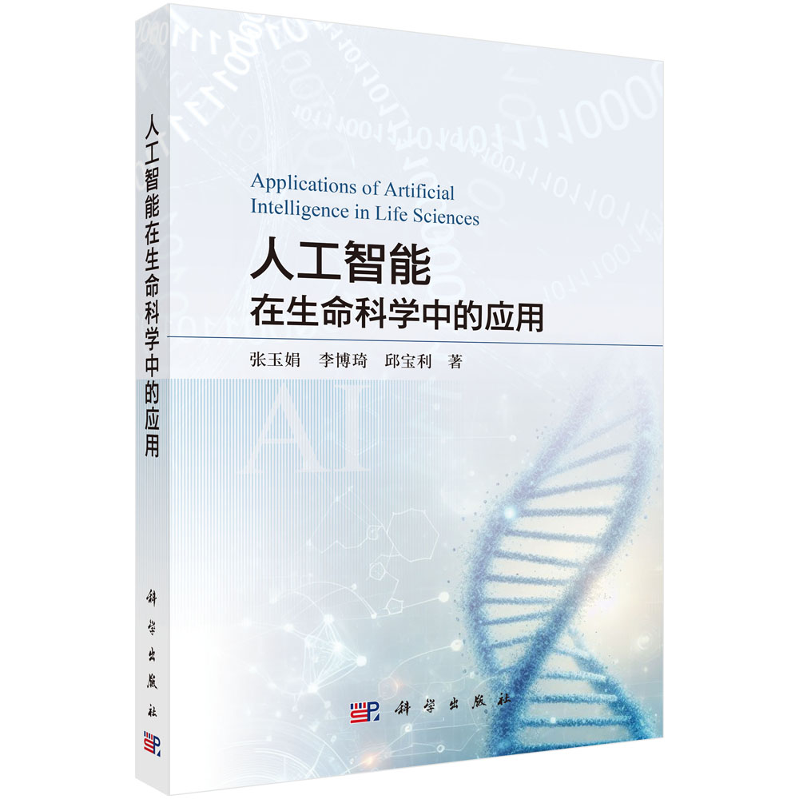
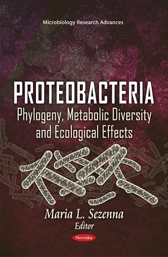

## Books and chapters

::: {layout="[30, 70]"}

**Yu-Juan Zhang**, Boqi Li, Baoli Qiu. ***Applications of Artificial Intelligence in Life Sciences***. [Science Press](https://mp.weixin.qq.com/s/atovpgj7_FrgTnmsPKxSQA), 2026.
:::

::: {layout="[8, 92]"}

**Zhang YJ**; Wen JF, Proteobacteria and the endosymbiotic origin of mitochondrion in "Proteobacteria: Phylogeny, Metabolic Diversity and Ecological Effects", ***Nova Science Publishers***, 2011.
:::

---

## Patents and Software Copyrights

* Intelligent Assisted Ubiquitinated Protein Detection Platform V1.0 (Software Copyright). 2025. Registration No. 2025SR0582782.
* A Computational Method for Basic Stoichiometric Genomic Analysis (Invention Patent). Application No. 202110905333.9.
* A Joint Analysis Method for Stoichiometric Genomes and Genome Annotation Files (Invention Patent). Application No. 202110906004.6.
* A Batch Analysis Method for Multi-species Stoichiometric Genomes (Invention Patent). Application No. 2021109053.
* A High-throughput Method for Multi-species Stoichiometric Proteome Analysis (Invention Patent). Application No. 202210259556X.
* A High-throughput Method for Multi-species Stoichiometric Transcriptome Analysis (Invention Patent). Application No. 202210159540.

---

## Publications

(\*Equally contributed, \*Corresponding)

### 2026

* Jinzhou Wu, Donglin He, Xin Li, Rui Wang, **Yu-Juan Zhang\***. A multi-view collaborative heterogeneous graph neural network with semantic- and relation-aware for drug-disease association prediction. ***Engineering Applications of Artificial Intelligence***. 2026.

### 2025

* Yawen Sun, Rui Wang, Zeyu Luo, Lejia Tan, Junhao Liu, Ruimeng Li, Dongqing Wei, **Yu-Juan Zhang\***. ESM2\_AMP: An Interpretable Framework for Protein-protein Interactions Prediction and Biological Mechanism Discovery. ***Briefings in Bioinformatics***. 2025.
* Junhao Liu, Zeyu Luo, Yawen Sun, Rui Wang, Xin Li, XinYun Ye, Dong-Qing Wei, **Yu-Juan Zhang**. ProtLoc-Mex1: Interpretable Analysis of Amino Acids Sequence Chemical Feature and GO Annotations for Predicting Protein Subcellular Localization. ***J. Comput. Biophys. Chem.*** 2025.
* **Yu-Juan Zhang**, Yawen Sun, Chen Meng, Mingxing Ye, Donglin He, Zhen Tian Yan, Bin Chen. Relationship between the symbiotic microbial community and insecticide resistance in wild Anopheles sinensis. ***Acta Entomologica Sinica***. 2025, 68(5): 626-637.

### 2024

* Junhao Liu, Zeyu Luo, Rui Wang, Xin Li, Yawen Sun, Zongqing Chen, **Yu-Juan Zhang\***. EUP: Enhanced Cross-species Prediction of Ubiquitination Sites via a Conditional Variational Autoencoder Network Based on ESM2. ***PLOS Computational Biology***. 2024.
* Zeyu Luo, Rui Wang, Yawen Sun, Junhao Liu, Zongqing Chen\*, **Yu-Juan Zhang\***. Interpretable Feature Extraction and Dimensionality Reduction in ESM2 for Protein Localization Prediction. ***Briefings in Bioinformatics***. 2024.
* Xiang-Ying Li, Feng-Ling Si, Xiao-Xiao Zhang, **Yu-Juan Zhang**, Bin Chen. Characteristics of Trypsin genes and their roles in insecticide resistance in the malaria vector Anopheles sinensis. ***Pesticide Biochemistry and Physiology***. 2024.
* Chen Meng, Zhentian Yan, Liang Qiao, Fengling Si, Shulin He, Xinyue Zhang, Yuting Luo, Bin Chen, **Yu-Juan Zhang\***. Bulked segregant analysis sequencing (BSA-seq) reveal candidate genes associated with pyrethroid resistance in Wuxi strain of Anopheles sinensis. 2024.

### 2023

* **Yu-Juan Zhang**, Zeyu Luo, Yawen Sun, Junhao Liu, Zongqing Chen. From Beasts to Bytes: Revolutionizing Zoological Research with Artificial Intelligence. ***Zoological Research***. 2023. 44(6):1115-1131.
* Xin Qiu, Chen Meng, Wenbin Wang, Bin Chen, **Yu-Juan Zhang**. Relationship between the symbiotic microbial community and insecticide resistance in wild Anopheles sinensis. ***Acta Entomologica Sinica***. 2023, 66(9): 1183-1191.
* Man Zhang, Chengxu Zhu, Zeyu Luo, Junhao Liu, Yawen Sun, Muhammad Tahir Khan, Dong-Qing Wei, **Yu-Juan Zhang\***. Exploring key proteins, pathways and oxygen usage bias of proteins and metabolites in melanoma. ***Journal of Computational Biophysics and Chemistry***. 2023.
* Yang Lan, Yimiao Liang, Xu Xiao, Yun Shi, Mengli Zhu, Chen Meng, Shujuan Yang, Muhammad Tahir Khan, **Yu-Juan Zhang\***. Stoichioproteomics study of differentially expressed proteins and pathways in head and neck cancer. ***Brazilian Journal of Biology***. 2023.
* Zhu ML, **Yu-Juan Zhang**. Gene Expression Profiling Analysis of Escherichia coli under the Conditions of Glucose and Glycerol Carbon Source Culture. ***Journal of Chongqing Normal University***. 2023.

### 2022

* Shi Yun, He Ping, Tu Xudong, **Yu-Juan Zhang**. Tandem Mass Tags Quantitative Proteomics Analysis of Gastric Epithelial Cell Line GES-1 Cultured in Different pH Environments. ***Genomics and Applied Biology***. 2022.
* **Yu-Juan Zhang\***, Muhammad Tahir Khan\*, Madeeha Shahzad Lodhi, et al. Novel Mutations in Putative Nicotinic Acid Phosphoribosyltransferases of Mycobacterium tuberculosis. ***Polymers***. 2022, 14(8), 1623.
* Madeeha Shahzad Lodhi, et al., **Yu-Juan Zhang**, Kejie Mou. A Novel Method of Magnetic Nanoparticles Functionalized with Anti-Folate Receptor Antibody. ***Molecules***. 2022. 27(1):261.

### 2021

* **Yu-Juan Zhang**, Yang Lan, Bin Chen. ASDB: A comprehensive omics database for Anopheles sinensis. ***Genomics***. 2021, 3(113): 976-982.
* Aman Chandra Kaushik, et al., **Yu-Juan Zhang**, Dong-Qing Wei. A-CaMP: a tool for anti-cancer and antimicrobial peptide generation. ***J Biomol Struct Dyn***. 2021. 39(1):285-293.
* Khan, M. Tahir, et al., **Yu-Juan Zhang**, Wei, D. Q. CYP1A2, 2A13, and 3A4 network and interaction with aflatoxin B-1. ***World Mycotoxin Journal***. 2021, 14(2): 179-189.
* Muhammad Tahir Khan, et al., **Yu-Juan Zhang**, et al. Insight into the drug resistance whole genome of Mycobacterium tuberculosis isolates from Khyber Pakhtunkhwa, Pakistan. ***Infect Genet Evol***. 2021.

### 2020

* Khan MT, et al., **Yu-Juan Zhang**, Wei DQ. Marine natural compounds as potents inhibitors against the main protease of SARS-CoV-2. ***J Biomol Struct Dyn***. 2020.

### 2019

* Khan MT, et al., **Yu-Juan Zhang**, Wei DQ. Marine Natural Products and Drug Resistance in Latent Tuberculosis. ***Mar Drugs***. 2019, 17(10).
* Zuo XY, Li B, Zhu CX, Yan ZW, Li M, Wang XY, **Yu-Juan Zhang\***. Stoichiogenomics reveal oxygen usage bias, key proteins and pathways associated with stomach cancer. ***Scientific Reports***. 2019.
* Yongqin Yin, Bo Li, et al., **Yu-Juan Zhang\***. Stoichioproteomics reveal oxygen usage bias, key proteins and pathways in glioma. ***BMC Med Genomics***. 2019.
* XIAO Xu, et al., **Yu-Juan Zhang**. Analysis of Competitiveness in Entomology Research in China Based on NSFC in 2009-2016. ***Fudan University Journal***. 2019.
* Wang XT, **Yu-Juan Zhang**, Qiao L, Chen B\*. Comparative analyses of simple sequence repeats (SSRs) in 23 mosquito species genomes. ***Insect Science***. 2019.
* Lan Y, X He, **Yu-Juan Zhang\***. Application of R language graphics in biological research. ***Journal of East China Normal University***. 2019.
* Sun L, et al., **Yu-Juan Zhang**, Chen B. The complete mt genomes of Lutzia halifaxia, Lt. fuscanus and Culex pallidothorax. ***Parasites & Vectors***. 2019.

### 2018

* **Yu-Juan Zhang**, Zhu C, Ding Y, et al. Subcellular stoichiogenomics reveal cell evolution and electrostatic interaction mechanisms in cytoskeleton. ***BMC Genomics***. 2018. 19(1): 469.
* Yong Zhou, et al., **Yu-Juan Zhang**, Bin Chen. UDP-glycosyltransferase genes and their association with pyrethroid resistance in Anopheles sinensis. ***Malaria Journal***. 2018.
* Yi-Ran Ding, Bo Li, **Yu-Juan Zhang**, et al. Complete mitogenome of Anopheles sinensis and mitochondrial insertion segments. ***Plos One***. 2018.

### 2017

* Lan Y, Hu JT, **Yu-Juan Zhang\***. Research progress of stoichiogenomics. ***Hereditas (Beijing)***. 2017. 39(2):89-97.

### 2016

* Wang XT, **Yu-Juan Zhang**, He X, Mei T, Chen B. Identification and distribution of microsatellites in the whole genome of Anopheles sinensis. ***Acta Entomologica Sinica***. 2016.
* You-Jin Hao, **Yu-Juan Zhang**, et al. Insight into the possible mechanism of the summer diapause of Delia antiqua through digital gene expression analysis. ***Insect Science***. 2016.
* Xiu He, et al., **Yu-Juan Zhang**, Bin Chen. Genome-wide identification and characterization of odorant-binding protein genes in Anopheles sinensis. ***Insect Sci***. 2016.

### 2015

* Guo Q, Hao Y-J, Li Y, **Yu-Juan Zhang**, et al. Gene cloning and enzymatic activities related to trehalose metabolism during diapause of Delia antiqua. ***Gene***. 2015.
* YAN Zhengwen, **Yu-Juan Zhang**, ZHOU Yong, Chen B. Identification and Bioinformatic Analysis of the CYP4G17 Gene in Anopheles sinensis. ***Journal of Chongqing Normal University***. 2015.

### 2014

* Chen B, **Yu-Juan Zhang**, et al. De novo transcriptome sequencing and sequence analysis of the malaria vector Anopheles sinensis. ***Parasites & Vectors***. 2014.
* **Yu-Juan Zhang**, Hao YJ, Si FL, et al. The de novo transcriptome and its analysis of the worldwide vegetable pest, Delia antiqua. ***G3: Genes, Genomes, Genetics***. 2014.
* **Yu-Juan Zhang**, Yang CL, Hao YJ, Chen B, Wen JF. Macroevolutionary trends of atomic composition in eukaryotic and prokaryotic proteins. ***Gene***. 2014.
* Tang Y, Qiao L, **Yu-Juan Zhang**, et al. Identification and bioinformatics analysis of genes of the CYP6Y subfamily in Anopheles sinensis. ***Acta Entomologica Sinica***. 2014.
* Che YF, **Yu-Juan Zhang**, et al. Bioinformatic identification and characterization of CYP6P5 gene in Anopheles sinensis. ***Chin J Vector BioJ & Control***. 2014.

### 2013

* **Yu-Juan Zhang\***, Li JJ, Hao YJ, Chen B. Charged amino acid frequencies of proteins over macroevolutionary time scale. ***Engineering***. 2013.
* Zhang NX, **Yu-Juan Zhang**, Yu G, Chen B. Structure characteristics of the mitochondrial genomes of Diptera. ***Acta Entomologica Sinica***. 2013.
* Li Y, Hao YJ, **Yu-Juan Zhang**, Si FL, Chen B. Cloning and expression of trehalose-6-phophate synthase gene from Delia antiqua. ***Acta Entomologica Sinica***. 2013.
* Shi YY, Che YF, **Yu-Juan Zhang\***. Protein transport in secondary plastids. ***Chemistry of Life***. 2013.

### 2012

* Li Y, Gao Y, **Yu-Juan Zhang**, Hao YJ. Comparison of lipogenesis capacity of Grass Carp preadipocyte from different anatomical sites. ***Journal of Animal and Veterinary Advances***. 2012.
* Wei HH, **Yu-Juan Zhang**, Chen B. Cloning, expression and bioinformatic analysis of dorsal Gene in Delia antiqua. ***Plant Diseases and Pests***. 2012.
* **Yu-Juan Zhang\***, Tan H. Diversity of protist plastids (chloroplasts) and its causation analyses. ***Chemistry of Life***. 2012.
* **Yu-Juan Zhang**, Wen JF. Research progresses of YidC/Oxa/Alb3 protein family. ***Chemistry of Life***. 2012.

### 2011

* **Yu-Juan Zhang**, Wen JF. Proteobacteria and the endosymbiotic origin of mitochondrion. In: Maria L. Sezenna Editors. ***Nova Science Publisher***. 2011. P57-71.
* **Yu-Juan Zhang**, Zhang YQ, Wen JF. Recent progresses of protein translocation into chloroplast and mitochondrion in plants. ***Chemistry of Life***. 2011.

### 2009

* **Yu-Juan Zhang**, Tian HF, Wen JF. The evolution of YidC/Oxa/Alb3 family in the three domains of life: a phylogenomic analysis. ***BMC Evolutionary Biology***. 2009.